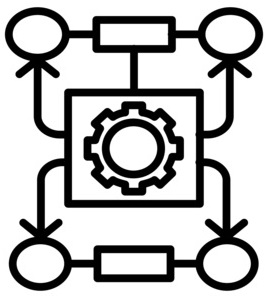

<a name="readme-top"></a>

<div align="center">

  
  <h1><b>Algorithm Master</b></h1>

</div>


<!-- TABLE OF CONTENTS -->

# 📗 Table of Contents

- [📖 About the Project](#about-project)
  - [🛠 Built With](#built-with)
    - [Key Features](#key-features)
  - [🚀 Live Demo](#live-demo)
- [💻 Getting Started](#getting-started)
  - [Setup](#setup)
  - [Prerequisites](#prerequisites)
  - [Install](#install)
  - [Usage](#usage)
  - [Deployment](#deployment)
- [👥 Authors](#authors)
- [🔭 Future Features](#future-features)
- [🤝 Contributing](#contributing)
- [⭐️ Show your support](#support)
- [📝 License](#license)

<!-- PROJECT DESCRIPTION -->

# 📖 Project Name

## Algorithm Master

## 🛠 Built With <a name="built-with"></a>

- `HTML`, `CSS`, `JavaScript`, and `ReactJS`

<!-- Features -->

### Key Features <a name="key-features"></a>

> Describe between 1-3 key features of the application.

- A **Single Page Application** (SPA) created using `React` library.
- This web application can be used to simulate various algorithms in computer science according to user provided inputs in real time.
- Code is written following **__JSX__** syntax.
- The web application is maintained using `Redux store`.
- The web application is currently under construction.

<p align="right">(<a href="#readme-top">back to top</a>)</p>

<!-- LIVE DEMO -->

## 🚀 Live Demo <a name="live-demo"></a>

The project is currently under construction.

<p align="right">(<a href="#readme-top">back to top</a>)</p>

<!-- GETTING STARTED -->

## 💻 Getting Started
To clone the repository in local environment try following steps.

### Prerequisites

- [x] A web browser like Google Chrome.
- [x] A code editor like Visual Studio Code with Git and Node.js.

You can check if Git is installed by running the following command in the terminal.
```
$ git --version
```

Likewise for Node.js and npm for package installation.
```
$ node --version && npm --version
```
### Setup

Clone the repository using [this link](https://github.com/PrangonGhose/algorithm-master.git).

### Install

In the terminal, go to your file directory and run this command.

```
$ git clone https://github.com/PrangonGhose/algorithm-master.git
```
### Get into development

In the terminal, run these commands to get into development.
```
$ cd bookstore-with-react

$ npm init -y

$ npm install (install dependencies)

$ npm run build (create the optimized for production)

$ npm start (run the app locally)
```
### Usage

This website is applicable for both mobile and desktop version.

### Deployment

<p align="right">(<a href="#readme-top">back to top</a>)</p>

<!-- AUTHORS -->

## 👥 Authors <a name="authors"></a>

👤 **Prangon Ghose**

- GitHub: [@PrangonGhose](https://github.com/PrangonGhose)

<p align="right">(<a href="#readme-top">back to top</a>)</p>

<!-- FUTURE FEATURES -->

## 🔭 Future Features <a name="future-features"></a>

- [ ] **Styling of the webpage**
- [ ] **Introduce animations for a smooth user experience**
- [ ] **Introduce more algorithms and data structures**
<p align="right">(<a href="#readme-top">back to top</a>)</p>

<!-- CONTRIBUTING -->

## 🤝 Contributing <a name="contributing"></a>

Contributions, issues, and feature requests are welcome! Add suggestions by opening new issues.

Feel free to check the [issues page](https://github.com/PrangonGhose/algorithm-master/issues).

<p align="right">(<a href="#readme-top">back to top</a>)</p>

<!-- SUPPORT -->

## ⭐️ Show your support <a name="support"></a>

Give a ⭐️ if you like this project!

<p align="right">(<a href="#readme-top">back to top</a>)</p>

<!-- LICENSE -->

## 📝 License <a name="license"></a>

This project is [MIT](./LICENSE) licensed.
